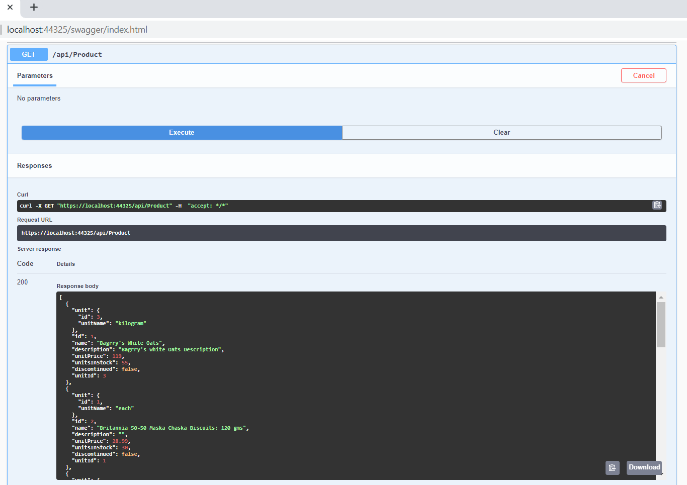

# ShopBridge-Backend Admin

This repository contains a solution and its projects which are dealing with maintaining product inventory. You can GET/POST/PUT and DELETE them. 
Technology Stack
1. ASP.Net Core Web API
2. SQL Server


To run this soultion offline, 
1. Download project. 
2. Execute ShopDBScript.sql placed in /ShopBridge.WebAPI/Resources/ 
3. Change connection string in appsettings.json
4. Run the project

Hope this helps.

See the examples here: 

## Http Methods

``` https://localhost:44325/swagger/index.html ```


## GET all products

```https://localhost:44325/api/Product ```



## GET single product

``` https://localhost:44325/api/Product/12 ```


## POST a product

``` https://localhost:44325/api/Product/ ```

```javascript
  {
  "id": 0,
  "name": "Test Product 12",
  "description": "Test Product 12 - Desc",
  "unitPrice": 25,
  "unitsInStock": 30,
  "discontinued": false,
  "unitId": 2
}
```


## PUT a product

``` https://localhost:44325/api/Product/12 ```

``` javascript
{
  "id": 12,
  "name": "Test Product 12 - update",
  "description": "Test Product 12 - Desc - update",
  "unitPrice": 27,
  "unitsInStock": 300,
  "discontinued": false,
  "unitId": 2
}
```


## DELETE a product

``` https://localhost:44325/api/Product/12 ```


## unit test


